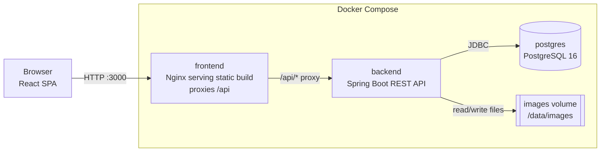
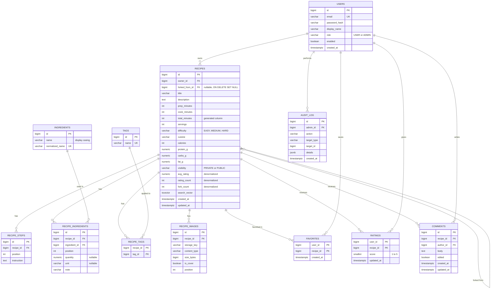

# Recipe Manager — Technical Specification

| | |
|---|---|
| **Status** | Draft v0.1 |
| **Owner** | Adithya S Sekhar |
| **Last updated** | 2026-09-30 |
| **Related** | [Product Requirements](./PRD.md) |

Requirement IDs such as `REC-1` refer to the [PRD](./PRD.md). Items marked *(default)* are proposals that can be changed.

---

## 1. Tech stack

| Layer | Choice |
|---|---|
| Frontend | React 18, TypeScript, Vite, React Router, TanStack Query, React Hook Form + Zod, Tailwind CSS *(default)* |
| Backend | Java 21, Spring Boot 3.x (Web, Security, Data JPA, Validation, Actuator), springdoc-openapi |
| Auth | Spring Security, stateless JWT (HS256), BCrypt |
| Database | PostgreSQL 16, Flyway migrations |
| Images | Local filesystem mounted as a Docker volume. Thumbnails generated with Thumbnailator *(default)* |
| Build | Maven (backend), npm (frontend) |
| Containers | Docker, Docker Compose |
| Testing | JUnit 5, Spring Boot Test, Testcontainers (Postgres), MockMvc; Vitest, React Testing Library, MSW |
| CI | GitHub Actions |

---

## 2. Architecture



- The SPA is served by Nginx. Nginx proxies `/api/*` to the backend, so the browser sees a single origin and no CORS setup is needed in Docker.
- The backend is stateless (JWT), so the only persistent state is in Postgres and the images volume.
- For local development outside Docker, the Vite dev server proxies `/api` to `localhost:8080`.

### 2.1 Repository layout

```
recipe-manager/
├── backend/                 # Spring Boot app (Maven)
├── frontend/                # React app (Vite)
├── docs/                    # PRD, Tech Spec
├── docker-compose.yml
├── .env.example
└── .github/workflows/ci.yml
```

### 2.2 Backend package layout

```
com.recipemanager
├── config/          # Security, OpenAPI, web, storage properties
├── auth/            # AuthController, JwtService, JwtAuthFilter, UserDetails impl
├── user/            # User entity, repository, service, profile controller
├── recipe/          # Recipe, RecipeStep, RecipeIngredient entities; controller, service, specs, DTOs, mapper
├── ingredient/      # Ingredient catalog
├── tag/             # Tag catalog
├── image/           # RecipeImage entity, StorageService, ImageController
├── social/          # Favorite, Rating, Comment
├── admin/           # Admin controllers, AuditLog
└── common/          # Error handling, PageResponse, base entity, enums
```

Layering is **Controller → Service → Repository**. Controllers exchange DTOs only (Java records). Entities never leave the service layer. Mapping uses MapStruct *(default)*. Authorization checks live in services, for example `recipePermissionService.assertCanEdit(user, recipe)`, with `@PreAuthorize` used for role checks such as admin endpoints.

---

## 3. Data model



### 3.1 Key constraints and indexes

- `users.email` is unique on `lower(email)`.
- `ingredients.normalized_name` and `tags.name` are unique.
- `recipe_ingredients` is unique on `(recipe_id, ingredient_id)` (ING-2).
- `ratings` has a composite PK `(user_id, recipe_id)` and `CHECK (score BETWEEN 1 AND 5)` (SOC-3).
- There is at most one cover per recipe: a partial unique index `ON recipe_images(recipe_id) WHERE is_cover`.
- `recipes.forked_from_id` uses `ON DELETE SET NULL` (REC-3). Child tables use `ON DELETE CASCADE` from `recipes`.
- `total_minutes` is `GENERATED ALWAYS AS (COALESCE(prep_minutes,0) + COALESCE(cook_minutes,0)) STORED`, and is NULL when both inputs are NULL.
- Indexes:
  - GIN on `search_vector`
  - B-tree on `(visibility, created_at DESC)`, `avg_rating`, `total_minutes`, `calories`, `owner_id`
  - B-tree on `recipe_tags(tag_id)` and `recipe_ingredients(ingredient_id)`
  - `pg_trgm` GIN on `ingredients.normalized_name` and `tags.name` for autocomplete
- `avg_rating`, `rating_count` and `fork_count` are updated in the same transaction as the rating or fork write.

### 3.2 Enums

`Role`, `Difficulty`, `Cuisine` (PRD Appendix A), `Unit` (PRD Appendix B) and `Visibility` are Java enums stored as `varchar`.

---

## 4. REST API

The base path is `/api/v1`. All requests and responses are JSON except for image uploads. Authentication uses the header `Authorization: Bearer <jwt>`.

Auth column: **—** public, **U** any logged-in user, **O** owner, **A** admin. "Public*" means anyone for public recipes, and the owner or an admin for private ones.

### 4.1 Auth & profile

| Method | Path | Auth | Purpose | Req |
|---|---|---|---|---|
| POST | `/auth/register` | — | Create account, returns token + user | AUTH-1 |
| POST | `/auth/login` | — | Returns token + user | AUTH-2 |
| GET | `/me` | U | Current user | AUTH-3 |
| PATCH | `/me` | U | Update display name | AUTH-3 |
| PUT | `/me/password` | U | Change password (needs current password) | AUTH-3 |

### 4.2 Recipes

| Method | Path | Auth | Purpose | Req |
|---|---|---|---|---|
| GET | `/recipes` | — | Search public recipes (filters below) | SRCH-1..6 |
| GET | `/me/recipes` | U | Search my recipes (+ `visibility` filter) | REC-5 |
| GET | `/me/favorites` | U | Search my favorites | SOC-2 |
| GET | `/recipes/{id}` | Public* | Recipe detail | REC-4 |
| POST | `/recipes` | U | Create recipe | REC-1 |
| PUT | `/recipes/{id}` | O | Full update (steps, ingredients, tags replaced) | REC-2 |
| DELETE | `/recipes/{id}` | O, A | Delete | REC-3, ADM-1 |
| PATCH | `/recipes/{id}/visibility` | O | `{ "visibility": "PUBLIC" }` | SOC-1 |
| POST | `/recipes/{id}/fork` | U | Fork a public recipe, returns the new recipe | SOC-5 |

**Search query parameters** (for `GET /recipes`, `/me/recipes` and `/me/favorites`):

| Param | Example | Notes |
|---|---|---|
| `q` | `q=chicken curry` | Full-text search |
| `tags` | `tags=vegan&tags=quick` | ALL must match |
| `cuisine` | `cuisine=INDIAN&cuisine=THAI` | ANY |
| `difficulty` | `difficulty=EASY` | ANY |
| `include` | `include=12&include=40` | Ingredient IDs, ALL present |
| `exclude` | `exclude=7` | Ingredient IDs, NONE present |
| `maxTime` | `maxTime=30` | Minutes, on `total_minutes` |
| `minCalories`, `maxCalories` | `minCalories=200&maxCalories=600` | Per serving |
| `visibility` | `visibility=PRIVATE` | `/me/recipes` only |
| `sort` | `newest` \| `rating` \| `time` \| `relevance` | Default `newest`, or `relevance` when `q` is set |
| `page`, `size` | `page=0&size=12` | `size` max 48 |

**Recipe create/update body (abridged)**

```json
{
  "title": "Chicken Tikka Masala",
  "description": "Creamy, mildly spiced curry.",
  "prepMinutes": 20,
  "cookMinutes": 40,
  "servings": 4,
  "difficulty": "MEDIUM",
  "cuisine": "INDIAN",
  "nutrition": { "calories": 520, "proteinG": 38, "carbsG": 18, "fatG": 32 },
  "ingredients": [
    { "ingredientId": 12, "quantity": 500, "unit": "G", "note": "boneless thighs" },
    { "newIngredientName": "Garam masala", "quantity": 2, "unit": "TSP" }
  ],
  "steps": ["Marinate the chicken...", "Grill until charred...", "Simmer in sauce..."],
  "tags": ["curry", "dinner"]
}
```

Ingredients can reference an existing catalog ID or supply `newIngredientName`, which is resolved or created by normalized name. Tags are sent by name and created if missing. Images are handled separately (§4.3).

**Paginated response envelope**

```json
{
  "content": [ { "id": 1, "title": "...", "coverThumbUrl": "...", "totalMinutes": 60, "difficulty": "MEDIUM", "avgRating": 4.3, "ratingCount": 12, "owner": { "id": 3, "displayName": "Asha" } } ],
  "page": 0, "size": 12, "totalElements": 134, "totalPages": 12
}
```

### 4.3 Images

| Method | Path | Auth | Purpose | Req |
|---|---|---|---|---|
| POST | `/recipes/{id}/images` | O | `multipart/form-data`: `file`, `cover` (bool) | IMG-1..3 |
| PATCH | `/recipes/{id}/images/{imageId}` | O | `{ "cover": true }` or `{ "position": 2 }` | IMG-2 |
| DELETE | `/recipes/{id}/images/{imageId}` | O | Delete image and its files | IMG-2 |
| GET | `/images/{storageKey}` | Public* | Serve the original | IMG-1 |
| GET | `/images/{storageKey}/thumb` | Public* | Serve the thumbnail | IMG-3 |

### 4.4 Catalog

| Method | Path | Auth | Purpose | Req |
|---|---|---|---|---|
| GET | `/ingredients?q=chi&limit=10` | — | Autocomplete | ING-1 |
| POST | `/ingredients` | U | Create (idempotent by normalized name) | ING-1 |
| GET | `/tags?q=veg&limit=10` | — | Autocomplete | TAG-1 |

### 4.5 Social

| Method | Path | Auth | Purpose | Req |
|---|---|---|---|---|
| PUT | `/recipes/{id}/favorite` | U | Add favorite (idempotent) | SOC-2 |
| DELETE | `/recipes/{id}/favorite` | U | Remove favorite | SOC-2 |
| PUT | `/recipes/{id}/rating` | U (not owner) | `{ "score": 4 }` upsert | SOC-3 |
| DELETE | `/recipes/{id}/rating` | U | Remove my rating | SOC-3 |
| GET | `/recipes/{id}/comments?page=0` | Public* | List comments, newest first | SOC-4 |
| POST | `/recipes/{id}/comments` | U | Add comment | SOC-4 |
| PATCH | `/comments/{id}` | Author | Edit comment | SOC-4 |
| DELETE | `/comments/{id}` | Author, recipe owner, A | Delete comment | SOC-4, ADM-1 |

The recipe detail response includes the caller-specific fields `isFavorite`, `myRating`, `canEdit` and `forkedFrom { id, title, author, available }`.

### 4.6 Admin (all require role `ADMIN`)

| Method | Path | Purpose | Req |
|---|---|---|---|
| GET | `/admin/users?q=&page=` | List/search users | ADM-4 |
| PATCH | `/admin/users/{id}` | `{ "enabled": false }` | ADM-4 |
| PATCH | `/admin/tags/{id}` | Rename | ADM-2 |
| POST | `/admin/tags/{id}/merge` | `{ "targetId": 9 }` | ADM-2 |
| DELETE | `/admin/tags/{id}` | Delete tag | ADM-2 |
| PATCH | `/admin/ingredients/{id}` | Rename | ADM-3 |
| POST | `/admin/ingredients/{id}/merge` | `{ "targetId": 9 }` | ADM-3 |
| GET | `/admin/audit-log?page=` | View moderation log | ADM-1 |

Admins delete recipes and comments with the normal `DELETE` endpoints. The service writes an audit entry when the caller is an admin acting on someone else's content.

### 4.7 Errors

All errors use RFC 7807 `application/problem+json` (Spring `ProblemDetail`):

```json
{
  "type": "about:blank",
  "title": "Validation failed",
  "status": 400,
  "detail": "One or more fields are invalid.",
  "errors": [ { "field": "title", "message": "must be between 3 and 120 characters" } ]
}
```

| Status | When |
|---|---|
| 400 | Validation errors, malformed input |
| 401 | Missing, invalid or expired token |
| 403 | Authenticated but not allowed (e.g. editing someone else's recipe) |
| 404 | Not found, **or a private recipe the caller cannot see** (REC-4) |
| 409 | Duplicate email, duplicate ingredient in recipe |
| 413 | Upload exceeds size limit |
| 415 | Unsupported image type |

---

## 5. Authentication & security

1. **Register/Login:** passwords are hashed with BCrypt (strength 10). On success the server returns `{ token, user }`.
2. **JWT:** HS256. The secret comes from `JWT_SECRET` (≥ 32 bytes). Claims are `sub` (user id), `role` and `exp`. The token lifetime is 24 h *(default)*. There are no refresh tokens in v1.
3. **Filter:** `JwtAuthFilter` validates the token and loads the user. If the user is disabled, the request is rejected with 401 even when the token is valid (ADM-4).
4. **Client storage:** the token is kept in memory with a `localStorage` fallback for reloads *(default)*. The Axios/fetch wrapper attaches the header and redirects to `/login` on 401.
5. **Admin bootstrap:** on startup, if `ADMIN_EMAIL` and `ADMIN_PASSWORD` are set and no user with that email exists, an ADMIN user is created (ADM-5).
6. **Hardening:**
   - Validate every DTO with Bean Validation
   - Authorize every recipe/comment operation in the service layer
   - Render comments as plain text (React escapes by default; never use `dangerouslySetInnerHTML`)
   - Rate-limit `/auth/*` with Bucket4j *(default)*
   - Hide stack traces in production responses

---

## 6. Image handling

- **Upload:** multipart, with `spring.servlet.multipart.max-file-size=5MB`.
- **Validation:** the content type is detected from the file's magic bytes with Apache Tika *(default)*. Only `image/jpeg`, `image/png` and `image/webp` are allowed. The gallery limit is 5 non-cover images per recipe.
- **Storage:** `StorageService` interface with a `LocalFileStorageService` implementation. Files are written to `${STORAGE_DIR}/recipes/{recipeId}/{uuid}.{ext}` plus `{uuid}_thumb.{ext}` (400 px wide). `storage_key` is the relative path. The interface keeps a move to S3/MinIO simple later.
- **Serving:** `ImageController` streams files with `Cache-Control: public, max-age=31536000, immutable`. Keys are UUIDs, so a replaced image gets a new URL. Access follows recipe visibility.
- **Deletion:** files are deleted after the DB transaction commits (`@TransactionalEventListener(phase = AFTER_COMMIT)`). Recipe deletion removes the recipe's directory.
- **Fork:** image files are copied to new keys, so the fork is independent of the original.

---

## 7. Search implementation

- `search_vector` is maintained by a Postgres trigger. It combines the title (weight A), ingredient names (weight B) and description (weight C) using `to_tsvector('english', ...)`. It is recomputed when the recipe or its ingredients change.
- `q` is parsed with `websearch_to_tsquery('english', :q)`. Relevance sort uses `ts_rank`.
- Structured filters are built with **JPA Specifications** and composed into one query:
  - **Tags (ALL):** `recipe.id IN (SELECT recipe_id FROM recipe_tags rt JOIN tags t ... WHERE t.name IN (:tags) GROUP BY recipe_id HAVING COUNT(DISTINCT t.id) = :n)`
  - **Include ingredients (ALL):** the same `GROUP BY ... HAVING COUNT = n` pattern on `recipe_ingredients`
  - **Exclude ingredients:** `NOT EXISTS (SELECT 1 FROM recipe_ingredients WHERE recipe_id = r.id AND ingredient_id IN (:exclude))`
  - **Range filters:** `total_minutes <= :maxTime`, `calories BETWEEN ...` (NULL values are excluded automatically)
- Full-text predicates are native SQL fragments exposed through a custom repository (`RecipeSearchRepository`), because JPA Criteria cannot express `@@` directly. The alternative is registering the functions with Hibernate `FunctionContributor`.
- Visibility scoping is always applied first: `visibility = 'PUBLIC' AND owner.enabled` for `/recipes`, and `owner_id = :me` for `/me/recipes`.

---

## 8. Frontend

### 8.1 Structure

```
frontend/src
├── api/            # typed API client (fetch wrapper), endpoint functions
├── auth/           # AuthContext, ProtectedRoute, AdminRoute
├── components/     # RecipeCard, FilterPanel, TagInput, IngredientPicker, ImageUploader, StarRating, Pagination
├── features/
│   ├── browse/     # BrowsePage, useRecipeSearch (URL <-> filters)
│   ├── recipe/     # RecipeDetailPage, RecipeEditorPage, CommentsSection
│   ├── me/         # MyRecipesPage, FavoritesPage, ProfilePage
│   └── admin/      # UsersPage, TagsPage, IngredientsPage, AuditLogPage
├── lib/            # zod schemas, formatters, constants (cuisines, units)
└── main.tsx, App.tsx (routes)
```

### 8.2 Conventions

- **Server state:** TanStack Query with query keys like `['recipes', filters]` and `['recipe', id]`. Mutations invalidate the related keys. Favorite and rating use optimistic updates.
- **Filter state lives in the URL** (`useSearchParams`) to satisfy SRCH-6. The query key is derived from the URL.
- **Forms:** React Hook Form + Zod schemas that mirror the server validation. `useFieldArray` handles ingredients and steps, with drag-to-reorder through dnd-kit *(default)*.
- **Images in the editor:** a recipe must be saved before images can be uploaded. The "Create" flow saves first and then enables the image section. Upload progress is tracked with `XMLHttpRequest`/Axios `onUploadProgress`.
- **API types:** generated from the OpenAPI spec with `openapi-typescript` *(default)* so frontend and backend stay in sync.
- **Responsive:** mobile-first Tailwind. The filter panel becomes a slide-over drawer below `md`.

---

## 9. Docker & configuration

### 9.1 `docker-compose.yml` (outline)

```yaml
services:
  postgres:
    image: postgres:16-alpine
    environment:
      POSTGRES_DB: recipes
      POSTGRES_USER: ${DB_USER}
      POSTGRES_PASSWORD: ${DB_PASSWORD}
    volumes: [pgdata:/var/lib/postgresql/data]
    healthcheck:
      test: ["CMD-SHELL", "pg_isready -U ${DB_USER}"]
      interval: 5s

  backend:
    build: ./backend
    environment:
      SPRING_DATASOURCE_URL: jdbc:postgresql://postgres:5432/recipes
      SPRING_DATASOURCE_USERNAME: ${DB_USER}
      SPRING_DATASOURCE_PASSWORD: ${DB_PASSWORD}
      JWT_SECRET: ${JWT_SECRET}
      STORAGE_DIR: /data/images
      ADMIN_EMAIL: ${ADMIN_EMAIL}
      ADMIN_PASSWORD: ${ADMIN_PASSWORD}
    volumes: [images:/data/images]
    depends_on:
      postgres: { condition: service_healthy }
    ports: ["8080:8080"]   # exposed for Swagger UI during development

  frontend:
    build: ./frontend
    ports: ["3000:80"]
    depends_on: [backend]

volumes:
  pgdata:
  images:
```

### 9.2 Images

- **Backend Dockerfile:** multi-stage. `maven:3-eclipse-temurin-21` builds the jar, and `eclipse-temurin:21-jre-alpine` runs it as a non-root user.
- **Frontend Dockerfile:** multi-stage. `node:20-alpine` runs `npm ci && npm run build`, and `nginx:alpine` serves the result, with `nginx.conf` providing the SPA fallback (`try_files $uri /index.html`) and the `/api` proxy to `backend:8080`. The Nginx `client_max_body_size` is set to 6m.

### 9.3 Environment variables (`.env.example`)

| Variable | Purpose |
|---|---|
| `DB_USER`, `DB_PASSWORD` | Postgres credentials |
| `JWT_SECRET` | JWT signing key (≥ 32 chars) |
| `JWT_TTL_HOURS` | Token lifetime, default 24 |
| `STORAGE_DIR` | Image root inside the container |
| `ADMIN_EMAIL`, `ADMIN_PASSWORD` | Bootstrap admin |
| `SEED_DEMO_DATA` | `true` to load sample recipes, tags and ingredients on first start *(default: false)* |

---

## 10. Testing strategy

| Level | Tooling | Scope |
|---|---|---|
| Backend unit | JUnit 5, Mockito | Services: permissions, fork logic, rating aggregates, validation edge cases |
| Backend integration | Spring Boot Test, MockMvc, **Testcontainers Postgres** | Controllers end-to-end against real Postgres: auth, CRUD, every search filter combination, visibility/404 rules, image upload (temp dir), admin actions |
| Migration | Flyway on Testcontainers | Migrations apply cleanly from empty |
| Frontend unit/component | Vitest, React Testing Library, MSW | Filter panel ↔ URL sync, editor validation, ingredient picker, rating/favorite optimistic updates, protected routes |
| Smoke (optional) | Playwright *(default, later)* | Register → create → publish → search → favorite, against `docker compose` |

Targets: ≥ 80% line coverage on backend service classes *(default)*. Every PRD requirement ID has at least one integration or component test.

---

## 11. CI (GitHub Actions)

`.github/workflows/ci.yml` runs on push and pull request:

1. **backend** job: set up JDK 21 → `mvn -B verify` (unit and Testcontainers tests; Docker is available on `ubuntu-latest`) → upload the JaCoCo report.
2. **frontend** job: set up Node 20 → `npm ci` → `npm run lint` → `npm run typecheck` → `npm test -- --run` → `npm run build`.
3. **docker** job (needs both): `docker compose build` to verify that the images build. Registry push is out of scope for v1.

---

## 12. API documentation

- `springdoc-openapi-starter-webmvc-ui` serves the spec at `/api/v1/openapi.json` and Swagger UI at `/swagger-ui.html` (backend port 8080).
- A JWT bearer security scheme is declared so endpoints can be tried from Swagger UI after login.
- DTOs carry `@Schema` examples. The frontend type generation (§8.2) consumes the same spec.

---

## 13. Implementation milestones *(proposed)*

1. **Skeleton:** repo layout, Docker Compose, backend and frontend hello-world, CI, Flyway baseline.
2. **Auth:** register, login, JWT, admin bootstrap, frontend auth pages.
3. **Recipes core:** entities, CRUD, ingredients and tags catalog, editor and detail pages.
4. **Images:** upload, thumbnails, gallery, cover.
5. **Search:** full-text, filters, sort, pagination, URL-synced browse page.
6. **Social:** visibility, favorites, ratings, comments, fork.
7. **Admin:** users, tags/ingredients merge, audit log.
8. **Polish:** responsive pass, accessibility, seed data, docs, coverage.
